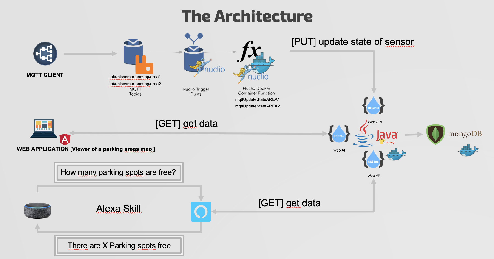

# UnisaSmartParking-ServerlessForIoTProject

The Unisa Smart Parking project aims to manage the availability of parking spots in the various parking areas with the help of IoT parking sensors.

The sensors that will be simulated are magnetic sensors with two possible state : ‘busy’ or ‘free’. 

Unisa Smart Parking is designed to manage : 

​	1.Several parking areas (or example, if you think about our Department there are two parking areas )

​	2.For each parking area, know how many parking spots are free or not, and what is their position.

**The Solution Proposed**

Each sensor maintain three information : 

​	• Id_sensor : unique id for all the sensor of specific area

​	• State : not null value, it can be «free» or «busy»

​	• Area : the area of the sensor. 

​    • For the solution proposed we will use two areas 

With a web application it will be possible to view the map of the parking lot, and identify the possible free parking spaces.

**Architecture**

